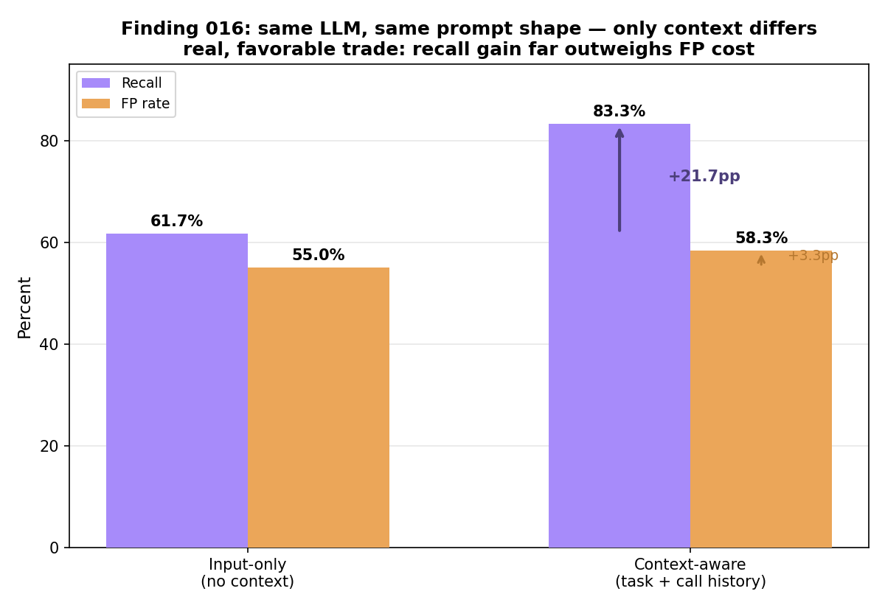
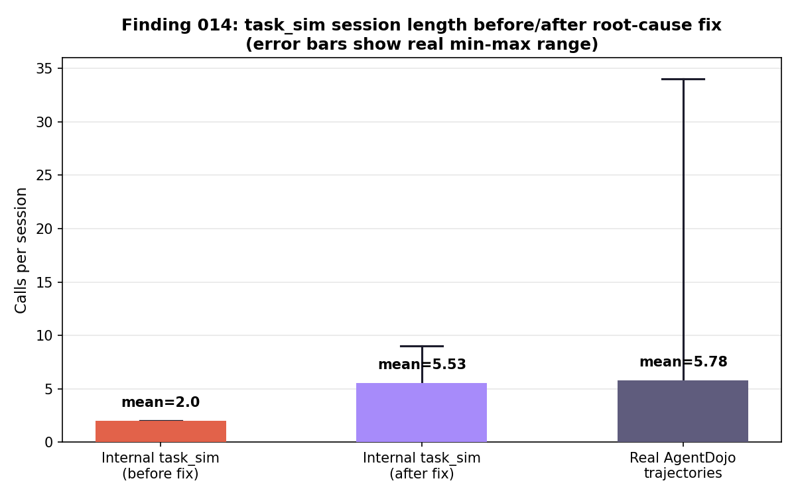
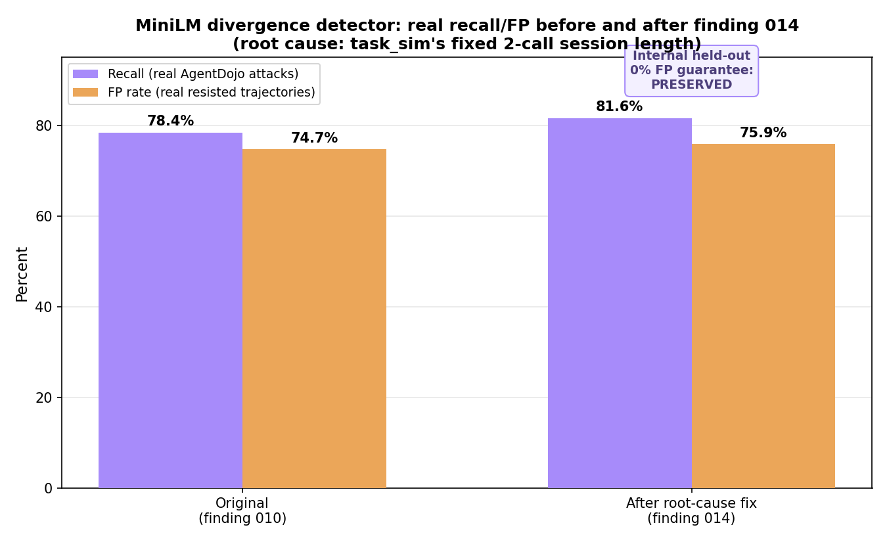
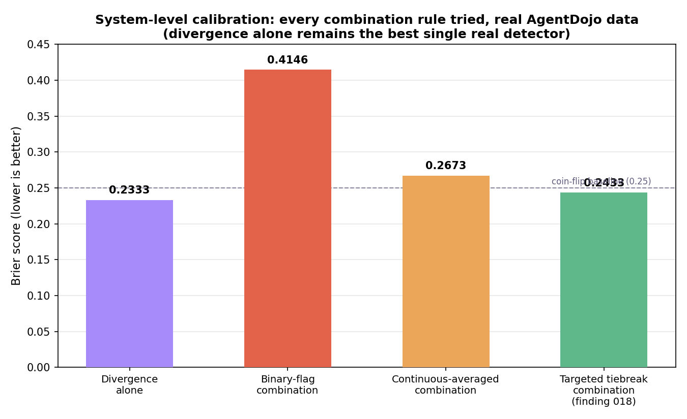
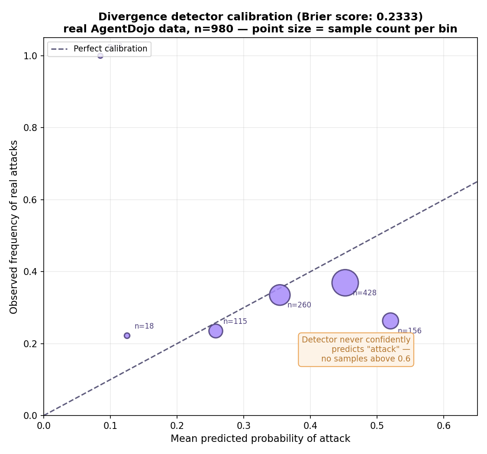
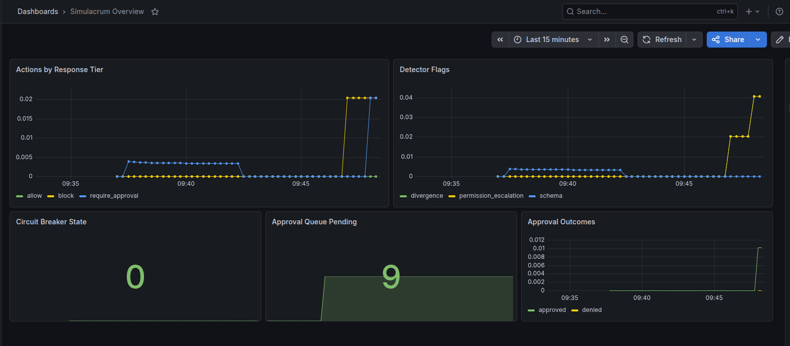

# SIMULACRUM

**Behavioral guardrails for tool-calling AI agents — a framework-agnostic interception layer that watches an agent's full action trajectory, not just a single prompt, to catch the moment a legitimate-looking tool call is actually driven by an instruction the user never gave.**

[](https://www.python.org/downloads/)
[](LICENSE)
[](#testing)
[](https://fastapi.tiangolo.com/)
[](https://redis.io/)
[](docker-compose.yml)

> A *simulacrum* is a representation that looks like the real thing but has no true original behind it — Baudrillard's copy without a referent. An injected tool call looks exactly like a legitimate action the agent might take. It just isn't one the user actually asked for.

---

## Table of Contents

- [Why This Exists](#why-this-exists)
- [What This Is / Is Not](#what-this-is--is-not)
- [Architecture](#architecture)
- [Key Results](#key-results)
- [Quickstart](#quickstart)
- [Usage](#usage)
- [Project Structure](#project-structure)
- [Testing](#testing)
- [Observability](#observability)
- [Documentation & Findings](#documentation--findings)
- [Roadmap & Scope](#roadmap--scope)
- [Contributing](#contributing)
- [License](#license)

---

## Why This Exists

Tool-using AI agents collapse a boundary that used to be structural: the channel an agent reads *instructions* from (a user, a retrieved document, a tool's own output, another agent) is the same channel it reads *data* from. There is no code-level line between "the user told me to do this" and "a webpage told me to do this."

Most existing defenses are input-side — classifiers that scan one message or one output for known-bad patterns. Simulacrum's premise is different: the reliable signal isn't in any single message, it's in whether an agent's **trajectory of actions** still correlates with what the user actually asked for — and whether a specific suspicious action can be traced back to the upstream content that most likely introduced it.

This is a self-contained portfolio/research engineering project, held to a production-grade standard: every claim is backed by a runnable script, every threshold is evidence-derived, and honest negative results are treated as first-class findings, not failures to hide. **21 documented findings** and **2 formal architectural decision records** trace the real history of what was tried, what worked, and what didn't.

---

## What This Is / Is Not

| | |
|---|---|
| ✅ **Is** | A self-hosted interception layer sitting at the tool-call boundary of any agent framework, scoring each action and the session's full trajectory for anomalous or injected behavior, enforcing a graduated, risk-tiered response including human-in-the-loop approval. |
| ❌ **Is not** | A jailbreak-proof guarantee. It has not been red-teamed by a professional security firm and will not catch every novel injection strategy — no system honestly can. It is a measured reduction in risk, with its own measured limits stated plainly. |
| ✅ **Is** | A working demonstration that session-level, trajectory-aware behavioral analysis catches injected and drifted agent behavior that single-message input classifiers structurally cannot — validated against a labeled, fault-injected internal corpus *and* the real, external [AgentDojo](https://github.com/ethz-spylab/agentdojo) benchmark, with honest recall and false-positive numbers reported throughout. |
| ❌ **Is not** | A replacement for input-side guardrail models (Llama Guard, NeMo Guardrails, and similar). Those catch obvious injection phrasing and known jailbreak patterns cheaply and early. Simulacrum is the complementary layer for what only shows up across a session. |
| ❌ **Is not** | A certified security control. This is a research/portfolio system that has not undergone professional red-teaming and must not be treated as sufficient protection for an agent with real financial or destructive capability without independent review. |

---

## Architecture

Every tool call passes through the interception layer before it executes.

Agent Framework → Interception Layer → Real Tool / Sandbox Tool
(any tool-calling (wraps the tool-
runtime) execution function)

                        │
            ┌─────────────┼─────────────┐
            ▼             ▼             ▼
    Per-Call Detectors  Session Store   Trajectory Model
    (schema, divergence, (Redis-backed,  (LLM-based goal-
     escalation, loop-    rolling         drift reasoning,
     rate, exfiltration,  trajectory)     async, off-path)
     content-pattern)
            │
            ▼
    Risk Tier Engine → allow / flag / require-approval / block
    (per tool-risk class: read-only, reversible, irreversible
     low/high value)

**Six real detectors** run through a circuit breaker as one scoring unit on every call:

| Detector | Signal |
|---|---|
| Schema conformance | Parameter shape violations |
| Param-vs-task divergence | Cosine similarity between a call's meaning and the evolving task representation (MiniLM or fake bag-of-words embedder) |
| Permission escalation | Session tool footprint vs. task-type baseline |
| Tool-loop rate | Repeated calls, with a retry-vs-evasion split (benign error-correction vs. adaptive parameter-varying evasion) |
| Exfiltration | Outbound-tool content/frequency vs. baseline |
| Content-pattern | LLM-based reasoning (Groq) about whether call content resembles a data-exfiltration payload, regardless of framing — the detector that closes a real, complete blind spot the five mechanical detectors alone missed |

A **circuit breaker** wraps every scoring call. Fail-open/fail-closed behavior is decided per tool-risk tier — a read-only call fails open on guardrail failure; an irreversible, high-value call fails closed and hard-blocks. Circuit-breaker state is available both in-memory (single-instance) and Redis-backed (multi-instance, verified across independent replicas).

---

## Key Results

Every number below is real, reproducible, and documented in [`docs/findings/`](docs/findings/).

### Session-awareness is real, not just architecturally claimed

Holding the underlying LLM reasoning mechanism fixed, giving it session context (task description + call history) produces a real, favorable trade over context-free reasoning:



A structural follow-up test confirmed this isn't just an empirical edge: an input-only classifier could not correctly distinguish gradual goal-drift sequences from legitimate ones at all — it flagged **every** case, including legitimate multi-step work — while a sequence-aware detector got all 5 real calibrated cases right.

### A real root-cause fix, not another threshold tweak

Three separate attempts to close a real generalization gap on external data (median/percentile aggregation, low-param exclusion, threshold+exemption recalibration) each failed the same way: any recall improvement broke the internal held-out false-positive guarantee. Root-cause diagnosis found why — the internal calibration corpus generated sessions of a **fixed 2-call length**, while real external attack trajectories average 5.78 calls. The guarantee had never actually been tested past 2 calls.



Fixing the corpus (variable-length sessions, realistic content diversity) and recalibrating from scratch produced the first configuration in the investigation's history to improve external recall **without** an internal regression:



### Honest, reported negative results

Every real combination rule tried for system-level detector calibration — binary-flag OR, continuous-confidence averaging, and a targeted evidence-scoped tiebreak rule — was measured, reported, and compared against the single best detector alone, including where combination made things *worse*:



### Real calibration, reported without spin



Brier score 0.2333 — barely better than a coin-flip baseline (0.25). This is reported directly, because a system that hides its own calibration weaknesses is more dangerous than one that states them.

### Live observability, real traffic



Real Grafana dashboard against real generated traffic — response-tier distribution, detector flags, circuit-breaker state, and approval-queue outcomes, all from actual requests through the running stack.

**Full data tables:** [`docs/README_TABLE_DATA.md`](docs/README_TABLE_DATA.md)

---

## Quickstart

### Prerequisites

- Python 3.12+
- Docker & Docker Compose (for the full stack: API, Redis, Prometheus, Grafana)
- A free [Groq API key](https://console.groq.com/) (optional — LLM-based detectors fail open to deterministic fallbacks without one)

### Fork & Clone

```bash
git clone https://github.com/<your-username>/SIMULACRUM.git
cd SIMULACRUM/simulacrum
```

### Run the Full Stack (recommended)

```bash
docker compose up -d --build
curl http://localhost:8000/health
```

This starts the API (`:8000`), Redis (`:6379`), Prometheus (`:9090`), and Grafana (`:3000`, dashboard pre-provisioned).

### Local Development Setup

```bash
python3 -m venv .venv
source .venv/bin/activate
pip install -e ".[dev]"

# Optional: real MiniLM embeddings (heavier, pulls in torch)
pip install -e ".[ml]"

# Required for the API and most tests
export SIMULACRUM_REDIS_URL="redis://localhost:6379/0"

# Optional — LLM-backed detectors fail open to deterministic fallbacks without this
export GROQ_API_KEY="your-key-here"

python3 -m pytest tests/unit/
```

Expect **331 passing** with `GROQ_API_KEY` and Redis available; fewer with clean skips otherwise (this is correct, not a bug).

---

## Usage

### Starting a session and intercepting a call

```bash
curl -X POST http://localhost:8000/sessions \
  -H "Content-Type: application/json" \
  -d '{"task_type": "inbox_triage"}'
# → {"session_id": "...", "task_type": "inbox_triage"}

curl -X POST http://localhost:8000/sessions/{session_id}/intercept \
  -H "Content-Type: application/json" \
  -d '{"tool_name": "read_inbox", "params": {"count": "5"}}'
```

### Handling a held (`require_approval`) call

```bash
curl -X POST http://localhost:8000/approvals/{request_id}/decide \
  -H "Content-Type: application/json" \
  -d '{"approved": true}'
```

An independent, out-of-band ops/security-approver channel is also available, requiring real API-key authentication (`X-Ops-Approver-Key` header, matching `SIMULACRUM_OPS_APPROVER_API_KEY`) — honestly disabled (503) if unconfigured, never silently permissive:

```bash
curl -X POST http://localhost:8000/approvals/{request_id}/ops-decide \
  -H "X-Ops-Approver-Key: your-configured-key" \
  -H "Content-Type: application/json" \
  -d '{"approved": true}'
```

### Exporting a per-session investigation report

```bash
curl http://localhost:8000/sessions/{session_id}/report
```

Returns every real call in the session, full per-call detector detail, and — for any held call — its real eventual approval outcome and approver role. Sensitive parameter values and LLM reasoning text are redacted before the response ever leaves the process.

### Using the Python library directly

```python
from simulacrum.attribution import FakeSemanticEmbedder, TaskRepresentation
from simulacrum.detectors import build_default_schema_registry, HeuristicContentPatternDetector
from simulacrum.interception import build_default_registry, intercept_and_call
from simulacrum.interception.circuit_breaker import CircuitBreaker
from simulacrum.risk_tiers import ToolRegistry
from simulacrum.session import InMemorySessionStore
from simulacrum.task_sim import TASK_INITIAL_USER_TEXT, TaskType
from simulacrum.tier_engine import ApprovalQueue

embedder = FakeSemanticEmbedder()
tier_registry = ToolRegistry()
task = TaskRepresentation.start(
    embedder=embedder,
    initial_user_text=TASK_INITIAL_USER_TEXT[TaskType.INBOX_TRIAGE],
)

result = intercept_and_call(
    tool_registry=build_default_registry(tier_registry=tier_registry),
    tier_registry=tier_registry,
    schema_registry=build_default_schema_registry(),
    session_store=InMemorySessionStore(),
    circuit_breaker=CircuitBreaker(),
    approval_queue=ApprovalQueue(),
    content_pattern_detector=HeuristicContentPatternDetector(),
    task_representation=task,
    task_type=TaskType.INBOX_TRIAGE,
    session_id="demo-session",
    tool_name="read_inbox",
    params={"count": "5"},
    turn_index=0,
)
print(result.response_tier, result.allowed)
```

---

## Project Structure     

simulacrum/
├── config/ # No-default resource URLs, env-driven settings
├── interception/ # Tool-call wrapper, circuit breaker (in-memory + Redis)
├── risk_tiers/ # Tool risk taxonomy, registry, fail-open/closed policy
├── detectors/ # Six explicit per-call and per-session detectors
├── attribution/ # Task embedding, provenance ranking, boundary/drift detection
├── tier_engine/ # Response-tier decision, approval queue + ops-approver role
├── task_sim/ # Shared normal-session generator (single source of truth)
├── attack_suite/ # Labeled attack generators, needle-in-haystack realism
├── generalization_set/ # Held-out mutated variants + real AgentDojo adapter
├── adversarial/ # Gradual-escalation, adaptive-retry, poisoning tests
├── evaluation/ # Calibration reports, baselines, combination-rule experiments
├── investigation/ # Exportable per-session investigation report
├── explainability/ # Structured explanations, attribution payloads
├── drift/ # PSI, event-driven version trigger, promotion gate
├── redaction/ # Sensitive-parameter scrubbing before any output
├── observability/ # Prometheus metrics
├── api/ # FastAPI app
└── session/ # SessionStore (in-memory + Redis)

docs/
├── findings/ # 21 numbered, permanent records of real bugs, results, and limits
├── decisions/ # Formal architectural decision records
├── assets/ # Real charts and dashboard screenshots
└── CALIBRATION_REPORT.md, README_TABLE_DATA.md, BACKLOG.md

---

## Testing

```bash
python3 -m pytest tests/unit/
```

- **331 tests**, real Redis and Groq API integration where relevant (skips cleanly without credentials)
- CI (`.github/workflows/ci.yml`): Redis service container, import-order check, full suite, genuine fresh-venv reproducibility check
- A calibration manifest (`evaluation/calibration_manifest.py`) checks every production threshold against its documented calibration at test time — catches silent drift between what's calibrated and what's actually running

---

## Observability

- **Metrics:** Prometheus (`:9090`) — action volume by tier, detector score distributions, circuit-breaker state, approval-queue depth and outcomes
- **Dashboard:** Grafana (`:3000`), dashboard-as-code, provisioned automatically
- **Audit trail:** every flagged/held/blocked call persists full detector detail, redacted, exportable per-session via the investigation report

---

## Documentation & Findings

This project's real engineering history — including honest negative results — is fully documented:

- [`docs/findings/`](docs/findings/) — 21 numbered findings, each with method, real data, and honest interpretation
- [`docs/decisions/`](docs/decisions/) — 2 formal architectural decision records
- [`docs/CALIBRATION_REPORT.md`](docs/CALIBRATION_REPORT.md) — full Brier score / reliability analysis
- [`docs/BACKLOG.md`](docs/BACKLOG.md) — live, current source of truth for open work

---

## Roadmap & Scope

| Phase | Status |
|---|---|
| Phase 0 — Foundations | ✅ Complete |
| Phase 1 — MVP | ✅ Complete |
| Phase 2 — Hardening | ✅ Complete |
| Phase 3 — Multi-instance breaker, ops-approver role, investigation report | ✅ Complete |
| Phase 3 — Second agent-framework integration | Deferred ([decision 002](docs/decisions/002-second-framework-deferred.md)) |
| Human-approval web UI | Out of scope by design (§02 of the blueprint) |

---

## Contributing

This is primarily a solo portfolio/research project, but issues and PRs are welcome. If contributing:

1. Read [`docs/BACKLOG.md`](docs/BACKLOG.md) for current open work
2. Every new threshold or calibration claim needs a real, runnable script backing it — see any file in `docs/findings/` for the expected standard
3. Run the full test suite before opening a PR: `python3 -m pytest tests/unit/`

---

## License

MIT — see [LICENSE](LICENSE).

---

*Simulacrum is a research/portfolio system. It has not undergone professional red-teaming, is not a certified security control, and must not be represented as sufficient protection for an agent with real financial or destructive capability without independent review.*
